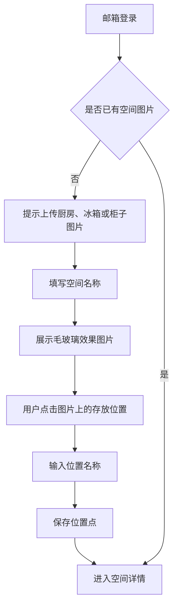
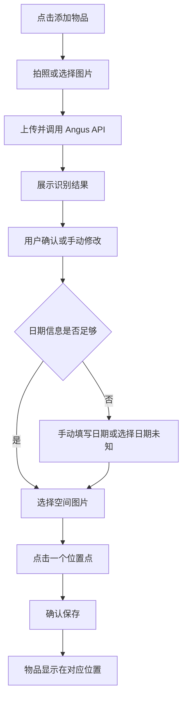
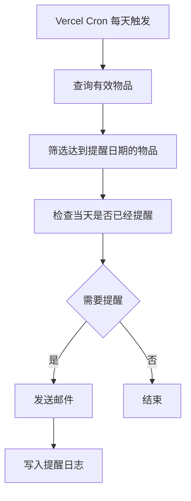

# 智能物品过期与位置管理工具

## 第一版 MVP 产品与技术设计文档

- 文档版本：MVP V1.0
- 编写日期：2026-07-29
- 产品形态：手机端优先的响应式 Web 应用
- 部署平台：Vercel
- 核心技术：Next.js、Supabase、Angus 图像识别 API、Vercel Cron、Resend

---

## 1. MVP 目标

第一版只验证一条核心闭环：

> 用户先创建真实存放位置，再拍照录入物品；系统尝试识别名称和日期，用户补充或纠正后选择具体位置保存，系统在物品过期前自动发送提醒。

MVP 需要解决三个问题：

1. 物品是什么。
2. 物品放在哪里。
3. 物品什么时候过期。

---

## 2. MVP 范围

### 2.1 必须实现

1. 用户通过手机浏览器访问系统。
2. 用户使用邮箱验证码登录。
3. 用户上传厨房、冰箱、柜子等存放空间图片。
4. 系统对空间图片增加白色半透明毛玻璃展示效果。
5. 用户在空间图片上点击一个点，创建存放位置并填写名称。
6. 用户拍照或上传物品图片。
7. 后端调用 Angus 图像识别 API，识别物品名称和日期信息。
8. 所有识别字段都允许用户手动修改。
9. 识别不到生产日期、保质期或过期日期时，用户可以手动填写。
10. 用户必须选择一个已创建的位置后才能完成物品保存。
11. 物品以缩略图或名称显示在对应位置附近。
12. 同一位置物品较多时，显示前 3 个缩略图和 `+N`，点击后打开底部列表。
13. Vercel Cron 每天检查即将过期物品。
14. 系统通过邮件发送过期提醒。
15. 用户可以将物品标记为“已使用”或“已丢弃”。

### 2.2 第一版不实现

- 原生 iOS 或 Android App。
- PWA 安装和离线模式。
- 家庭成员共享。
- 厨房、冰箱、层级柜子的多级树形结构。
- 图片矩形框选、拖动和缩放位置。
- AI 自动识别空间中的冰箱或柜子。
- 多张物品图片。
- 条形码扫描和商品数据库。
- Web Push、微信、短信提醒。
- 自定义多阶段提醒规则。
- 智能菜谱、库存数量和采购建议。
- 拖拽物品更换位置。
- 复杂动画和多级抽拉面板。

---

## 3. 简化后的产品模型

第一版仅保留三层结构：

```text
用户
  └── 空间图片
        └── 位置点
              └── 物品
```

示例：

```text
用户
  ├── 厨房图片
  │     ├── 冰箱
  │     └── 左侧柜子
  └── 冰箱内部图片
        ├── 冷藏第一层
        └── 冷冻抽屉
```

“厨房”和“冰箱内部”都作为独立空间图片处理，不在第一版建立复杂父子关系。

---

## 4. 核心用户流程

### 4.1 首次创建位置



### 4.2 录入物品



### 4.3 到期提醒



---

## 5. 页面设计

第一版只保留 7 个页面。

### 5.1 登录页

功能：

- 输入邮箱。
- 获取一次性验证码。
- 验证后进入系统。

不提供密码注册、第三方登录和用户资料编辑。

### 5.2 首页

展示：

- “添加物品”主按钮。
- 即将过期物品数量。
- 已创建的空间图片。
- 最近添加的物品。

空状态提示：

> 先上传一张厨房、冰箱或柜子的图片，并在图片上标记可以存放物品的位置。

### 5.3 新建空间页

字段：

| 字段 | 必填 | 说明 |
|---|---:|---|
| 空间名称 | 是 | 例如厨房、冰箱内部、药箱 |
| 空间图片 | 是 | 拍照或从相册上传 |

保存后直接进入“标记位置”模式。

### 5.4 空间详情页

页面结构从下到上：

1. 原始空间图片。
2. 白色半透明毛玻璃层。
3. 位置点。
4. 物品缩略图、名称或数量。
5. 当前选中位置的底部列表。

主要操作：

- 点击空白区域：新增位置点。
- 点击位置点：查看该位置的物品。
- 点击“添加物品”：进入物品扫描页。
- 删除空位置点。

第一版不支持拖动位置点；创建错误时删除后重新创建。

### 5.5 物品扫描页

功能：

- 调用手机相机。
- 从相册选择图片。
- 预览图片。
- 重新选择。
- 点击“开始识别”。

上传前前端压缩图片：

- 最长边不超过 1600px。
- JPEG 质量约 80%。
- 单张图片大小限制 5MB。

### 5.6 识别确认页

展示并允许修改：

| 字段 | 必填 | 说明 |
|---|---:|---|
| 物品名称 | 是 | AI 识别失败时手动输入 |
| 生产日期 | 否 | 日期选择器 |
| 保质期数值 | 否 | 例如 30 |
| 保质期单位 | 否 | 天、月、年 |
| 过期日期 | 否 | 可直接填写 |
| 提前提醒天数 | 是 | 默认 3 天 |

日期规则：

- 填写“生产日期 + 保质期”时，系统自动计算过期日期。
- 直接填写过期日期时，以用户填写值为准。
- 三项都缺失时允许选择“日期未知”，该物品不发送过期提醒。
- AI 识别结果只作为草稿，必须由用户确认后保存。

页面底部按钮：

> 下一步：选择位置

### 5.7 选择位置页

交互：

1. 顶部切换空间图片。
2. 图片上显示全部位置点。
3. 点击一个位置点。
4. 底部显示位置名称和当前物品数量。
5. 点击“存放到这里”完成保存。

没有任何位置点时，提示用户先点击图片创建位置，创建后继续当前保存流程。

---

## 6. 空间图片与位置交互

### 6.1 毛玻璃效果

第一版不生成第二张处理图片，只使用前端 CSS，降低存储和处理成本。

```css
.space-image {
  filter: saturate(0.75) contrast(0.9);
}

.space-glass-layer {
  position: absolute;
  inset: 0;
  background: rgba(255, 255, 255, 0.42);
  backdrop-filter: blur(4px);
  -webkit-backdrop-filter: blur(4px);
}
```

要求：

- 仍能看清冰箱、柜子等真实轮廓。
- 物品缩略图比背景更清晰。
- 毛玻璃层不写入原始图片。

### 6.2 位置点坐标

位置只保存点击点，不保存矩形区域。

```json
{
  "xRatio": 0.62,
  "yRatio": 0.31
}
```

坐标使用相对比例，保证不同屏幕尺寸下位置一致。

点击坐标计算：

```text
xRatio = 点击位置相对图片左侧的距离 / 图片实际展示宽度
yRatio = 点击位置相对图片顶部的距离 / 图片实际展示高度
```

### 6.3 位置点创建

用户点击图片空白处后弹出小表单：

- 位置名称。
- 保存。
- 取消。

例如：

- 冰箱。
- 冷藏第一层。
- 左侧柜子。
- 药箱上层。

### 6.4 位置上的物品展示

显示规则：

- 1～3 件：显示最多 3 个缩略图。
- 4 件以上：显示 3 个缩略图和 `+N`。
- 没有可用缩略图时，显示简短物品名称。

点击位置点后，从底部打开一个普通 Bottom Sheet，显示：

- 位置名称。
- 物品总数。
- 物品列表。
- 每件物品的过期状态。

第一版 Bottom Sheet 只有“打开”和“关闭”两种状态，不实现多级拖拽高度。

---

## 7. 图像识别设计

### 7.1 调用原则

前端不能直接调用 Angus API。调用流程：

```text
手机前端
  → Next.js Serverless API
  → Angus API
  → 标准化结果
  → 返回前端确认
```

Angus API Key 仅保存在 Vercel 环境变量中。

### 7.2 识别字段

第一版只要求 Angus 尝试识别：

- 物品名称。
- 生产日期。
- 保质期。
- 过期日期或有效期至。
- OCR 原始文字。

品牌、类别、存储建议不作为第一版必需字段。

### 7.3 标准返回结构

```json
{
  "name": "纯牛奶",
  "produceDate": "2026-07-20",
  "shelfLife": {
    "value": 180,
    "unit": "DAY"
  },
  "expireDate": null,
  "rawText": "生产日期 2026.07.20 保质期180天",
  "warnings": []
}
```

### 7.4 识别失败处理

下列情况都进入手动填写，不阻断流程：

- 接口超时。
- 免费额度用尽。
- 图片模糊。
- 没有识别到物品名称。
- 没有识别到任何日期。
- 返回日期互相冲突。

提示：

> 没有识别出完整信息，请手动补充后继续。

网络错误自动重试 1 次，不做后台重试队列。

---

## 8. 日期处理规则

### 8.1 数据优先级

1. 用户最终确认或手动填写的值。
2. 包装上直接识别出的过期日期。
3. 系统根据生产日期和保质期计算的值。
4. 未知。

### 8.2 自动计算

- 天：按自然日增加。
- 月：按自然月增加。
- 年：按自然年增加。
- 月末日期按目标月份最后一天处理。

例如：

```text
2026-01-31 + 1 个月 = 2026-02-28
```

### 8.3 冲突处理

如果识别出的过期日期与计算日期不一致：

- 不自动覆盖。
- 同时展示两个日期。
- 默认要求用户选择最终过期日期。

### 8.4 过期状态

系统根据 `expire_date` 动态计算：

| 状态 | 规则 |
|---|---|
| 正常 | 当前日期早于提醒日期 |
| 即将过期 | 当前日期达到 `expire_date - remind_days` |
| 已过期 | 当前日期晚于 `expire_date` |
| 日期未知 | 没有 `expire_date` |
| 已使用 | 用户主动标记 |
| 已丢弃 | 用户主动标记 |

数据库只保存业务状态 `ACTIVE / USED / DISCARDED`，过期状态由查询时计算，避免每天更新整张表。

---

## 9. 自动提醒

### 9.1 提醒规则

第一版每件物品仅保留一个提醒配置：

- `remind_days_before`，默认 3 天。
- 到期当天再次提醒一次。

日期未知、已使用和已丢弃的物品不提醒。

### 9.2 Vercel Cron

每天触发一次：

```json
{
  "crons": [
    {
      "path": "/api/cron/reminders",
      "schedule": "0 0 * * *"
    }
  ]
}
```

Cron 按 UTC 运行。接口根据用户时区判断用户当地日期。

### 9.3 提醒内容

邮件标题：

```text
3 件物品即将过期
```

邮件内容示例：

```text
纯牛奶还有 3 天过期
位置：冰箱内部 > 冷藏第一层

鸡蛋今天到期
位置：厨房 > 冰箱
```

### 9.4 防止重复发送

提醒日志唯一键：

```text
item_id + reminder_kind + local_date
```

`reminder_kind` 仅包含：

- `BEFORE_EXPIRE`
- `EXPIRE_TODAY`

---

## 10. 技术架构

```mermaid
flowchart LR
    A[手机浏览器] --> B[Next.js on Vercel]
    B --> C[Next.js Route Handlers]
    C --> D[Supabase Auth]
    C --> E[Supabase PostgreSQL]
    C --> F[Supabase Storage]
    C --> G[Angus API]
    H[Vercel Cron] --> I[/api/cron/reminders]
    I --> E
    I --> J[Resend 邮件]
```

### 10.1 技术选型

| 模块 | 技术 |
|---|---|
| 前端 | Next.js App Router + TypeScript |
| 样式 | Tailwind CSS |
| 部署 | Vercel |
| 用户认证 | Supabase Auth 邮箱 OTP |
| 数据库 | Supabase PostgreSQL |
| 图片存储 | Supabase Storage |
| ORM | Drizzle ORM |
| 图像识别 | Angus API |
| 定时任务 | Vercel Cron |
| 邮件提醒 | Resend |
| 图片背景处理 | CSS 毛玻璃层 |

第一版不使用 Redis、消息队列、独立后端服务、常驻定时进程和 Kubernetes。

---

## 11. 数据库设计

Supabase Auth 负责用户账号，业务数据库只保留 5 张表。

### 11.1 `spaces`

| 字段 | 类型 | 说明 |
|---|---|---|
| id | uuid | 主键 |
| user_id | uuid | 所属用户 |
| name | varchar(50) | 空间名称 |
| image_url | text | 原始空间图片 |
| image_width | int | 原图宽度 |
| image_height | int | 原图高度 |
| created_at | timestamptz | 创建时间 |

### 11.2 `locations`

| 字段 | 类型 | 说明 |
|---|---|---|
| id | uuid | 主键 |
| user_id | uuid | 所属用户 |
| space_id | uuid | 所属空间 |
| name | varchar(50) | 位置名称 |
| x_ratio | numeric(6,5) | 横向比例坐标 |
| y_ratio | numeric(6,5) | 纵向比例坐标 |
| created_at | timestamptz | 创建时间 |

约束：

```text
0 <= x_ratio <= 1
0 <= y_ratio <= 1
```

### 11.3 `items`

| 字段 | 类型 | 说明 |
|---|---|---|
| id | uuid | 主键 |
| user_id | uuid | 所属用户 |
| location_id | uuid | 存放位置，必填 |
| name | varchar(100) | 物品名称，必填 |
| image_url | text | 物品图片 |
| produce_date | date | 生产日期，可空 |
| shelf_life_value | int | 保质期数值，可空 |
| shelf_life_unit | varchar(10) | DAY/MONTH/YEAR，可空 |
| expire_date | date | 过期日期，可空 |
| remind_days_before | int | 提前提醒天数，默认 3 |
| source_raw_text | text | OCR 原始文字，可空 |
| status | varchar(20) | ACTIVE/USED/DISCARDED |
| created_at | timestamptz | 创建时间 |
| updated_at | timestamptz | 更新时间 |

### 11.4 `reminder_logs`

| 字段 | 类型 | 说明 |
|---|---|---|
| id | uuid | 主键 |
| user_id | uuid | 所属用户 |
| item_id | uuid | 物品 ID |
| reminder_kind | varchar(30) | BEFORE_EXPIRE/EXPIRE_TODAY |
| local_date | date | 用户当地日期 |
| send_status | varchar(20) | SENT/FAILED |
| error_message | text | 失败原因 |
| created_at | timestamptz | 创建时间 |

唯一约束：

```text
(item_id, reminder_kind, local_date)
```

### 11.5 `user_settings`

| 字段 | 类型 | 说明 |
|---|---|---|
| user_id | uuid | 主键 |
| email | varchar(255) | 提醒邮箱 |
| timezone | varchar(50) | 时区 |
| reminder_enabled | boolean | 是否启用提醒 |
| created_at | timestamptz | 创建时间 |
| updated_at | timestamptz | 更新时间 |

---

## 12. API 设计

### 12.1 空间

```text
POST   /api/spaces
GET    /api/spaces
GET    /api/spaces/:id
DELETE /api/spaces/:id
```

### 12.2 位置

```text
POST   /api/spaces/:spaceId/locations
DELETE /api/locations/:id
```

第一版不提供位置编辑接口；删除后重新创建。

### 12.3 图像识别

```text
POST /api/recognition/item
```

请求：

```json
{
  "imageUrl": "https://storage.example/item.jpg"
}
```

响应：

```json
{
  "success": true,
  "data": {
    "name": "纯牛奶",
    "produceDate": "2026-07-20",
    "shelfLife": {
      "value": 180,
      "unit": "DAY"
    },
    "expireDate": null,
    "rawText": "生产日期 2026.07.20 保质期180天"
  }
}
```

### 12.4 物品

```text
POST   /api/items
GET    /api/items
GET    /api/items/:id
PATCH  /api/items/:id
DELETE /api/items/:id
POST   /api/items/:id/use
POST   /api/items/:id/discard
```

### 12.5 提醒任务

```text
GET /api/cron/reminders
```

要求：

- 校验 `CRON_SECRET`。
- 不接受普通用户直接调用。
- 单次查询分页处理，避免超出 Serverless 执行限制。

---

## 13. 项目目录

```text
src/
├── app/
│   ├── login/
│   ├── page.tsx
│   ├── spaces/
│   │   ├── new/
│   │   └── [spaceId]/
│   ├── items/
│   │   ├── scan/
│   │   ├── confirm/
│   │   └── [itemId]/
│   └── api/
│       ├── spaces/
│       ├── locations/
│       ├── items/
│       ├── recognition/
│       └── cron/reminders/
├── components/
│   ├── SpaceCanvas.tsx
│   ├── LocationMarker.tsx
│   ├── LocationBottomSheet.tsx
│   ├── ItemThumbnail.tsx
│   ├── ItemForm.tsx
│   └── ExpiryBadge.tsx
├── lib/
│   ├── supabase/
│   ├── db/
│   ├── angus/
│   ├── date/
│   ├── storage/
│   └── email/
└── types/
```

---

## 14. 安全与限制

1. 所有业务表启用 Supabase Row Level Security。
2. 用户只能读取和修改自己的空间、位置和物品。
3. Angus、Resend 和 Cron 密钥只存放在 Vercel 环境变量。
4. 上传文件仅允许 JPEG、PNG、WebP。
5. 单张物品或空间图片最大 5MB。
6. 文件名使用随机 UUID，不使用用户原始文件名。
7. 删除空间时，必须先确认其中是否仍有位置或物品。
8. 删除位置时，存在物品则禁止删除，需先处理物品。
9. API 对图像识别接口按用户限制调用频率。
10. 日志不记录完整图片地址、API Key 或邮箱验证码。

---

## 15. 实现优先级

### P0：必须完成闭环

- 邮箱登录。
- 创建空间和上传图片。
- 点击图片创建位置点。
- 拍照上传物品。
- Angus 识别。
- 手动确认和补充日期。
- 点击位置完成保存。
- 空间图片展示物品。
- 每日邮件提醒。

### P1：完成基本管理

- 物品详情和编辑。
- 标记已使用或已丢弃。
- 位置物品 Bottom Sheet。
- 即将过期列表。
- 提醒日志和失败记录。

P0 完成后即可作为第一版 MVP 发布；P1 应在首次公开测试前完成。

---

## 16. MVP 验收标准

### 16.1 位置初始化

- 用户能上传一张空间图片。
- 图片能以白色毛玻璃效果展示。
- 用户点击图片后能创建一个命名位置。
- 不同手机宽度下位置点没有明显偏移。

### 16.2 物品录入

- 用户能调用手机相机或相册选择图片。
- Angus 成功时能回填识别字段。
- Angus 失败时仍能进入手动填写。
- 用户可以手动填写生产日期、保质期或过期日期。
- 用户必须选择一个位置后才能保存。
- 保存成功后物品显示在正确位置。

### 16.3 多物品展示

- 一个位置最多直接展示 3 个缩略图。
- 超过 3 个时显示 `+N`。
- 点击位置能查看完整物品列表。

### 16.4 日期和提醒

- 生产日期加保质期能正确计算过期日期。
- 直接填写过期日期能正常保存。
- 日期未知物品不会进入提醒任务。
- 提醒任务不会向同一物品重复发送同一节点提醒。
- 邮件中能显示物品名称、剩余天数和位置。

### 16.5 数据隔离

- 未登录用户不能访问业务页面。
- 用户不能读取其他用户的数据。
- API Key 不出现在前端请求和构建产物中。

---

## 17. 第一版完成定义

满足以下完整链路即认为 MVP 成立：

```text
登录
→ 上传冰箱图片
→ 点击创建“冷藏第一层”
→ 拍摄牛奶包装
→ Angus 自动识别部分信息
→ 用户补充或修正日期
→ 点击“冷藏第一层”完成保存
→ 牛奶缩略图出现在该位置
→ 到期前收到邮件提醒
→ 用户将牛奶标记为已使用
```

第一版只验证这条闭环，不增加与核心价值无关的扩展功能。
