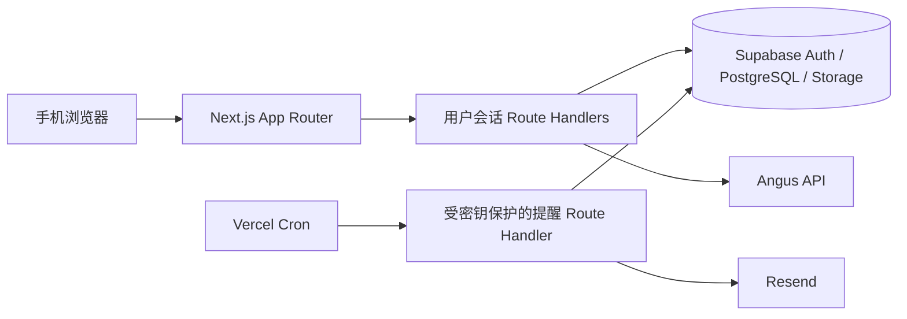

# FreshPin MVP 架构决策

日期：2026-07-29

## 1. 目标与第一性原理

FreshPin 只需可靠回答三个问题：物品是什么、放在哪里、何时过期。所有设计由这条最短闭环反推：

1. 数据必须只属于创建它的用户。
2. 位置坐标必须在不同屏幕尺寸下仍指向同一个真实位置。
3. AI 的结果只是可编辑草稿，不能替代用户确认的数据。
4. 提醒必须最多发送一次，且失败不能让后续任务失去可恢复性。

第一版不实现多人共享、层级空间、拖拽物品、多图商品、原生 App 或非邮件通知。

## 2. 系统边界



- **前端**：Next.js App Router。服务端组件负责读取受保护页面；客户端组件只负责相机/相册选择、图片画布交互和表单体验。
- **用户业务接口**：所有 Route Handler 从已验证的 Supabase 会话得到 `userId`；请求体、查询参数和路径中的任何 `user_id` 都不可信。
- **数据层**：Supabase PostgreSQL 是业务事实来源。Drizzle 只负责 schema 类型和迁移生成；浏览器用户的读写通过带会话的 Supabase server client 进行，以真正受 RLS 保护。
- **后台接口**：仅 Cron 使用服务角色密钥，且在校验 Cron 密钥成功后才创建服务角色客户端。
- **第三方服务**：Angus 与 Resend 只由服务端调用，密钥不会进入客户端构建产物。

## 3. 模块边界

| 模块 | 职责 | 不负责 |
|---|---|---|
| `auth` | 邮箱 OTP、回调、会话刷新、受保护路由 | 业务数据授权替代品 |
| `spaces` | 空间图片上传、列表、详情、删除 | 位置坐标计算 |
| `locations` | 归一化坐标、位置创建/删除、画布标记 | 物品日期判断 |
| `items` | 图片录入、人工确认、位置绑定、状态变更 | 图片存储权限绕过 |
| `recognition` | 持有的图片对象转发给 Angus、标准化草稿 | 自动保存物品 |
| `expiry` | 纯日期规则与展示状态计算 | 邮件发送 |
| `reminders` | 选择应提醒数据、原子占位、邮件投递 | 用户请求授权 |

纯领域代码（坐标换算、日期计算、状态判断、上传格式判断）放在 `src/lib`，不依赖 React、网络或数据库，因此可用快速单元测试覆盖。

## 4. 身份、授权与数据完整性

### 4.1 用户请求链路

```text
Browser cookie
  -> Supabase SSR server client 验证 getUser()
  -> 从会话派生 userId
  -> RLS + 外键 + CHECK 约束
  -> 仅返回该用户可见的数据
```

- 页面保护用于体验；每个业务 Route Handler 的会话校验才是权限边界。
- 变更请求检查同源 `Origin`，并只接受预期的 JSON 或 multipart 内容类型。
- `spaces`、`locations`、`items`、`reminder_logs`、`user_settings` 与私有 Storage bucket 都配置 owner-only RLS。
- `locations.space_id`、`items.location_id` 使用外键，删除使用 `RESTRICT`。非空空间或带物品的位置返回 `409`，避免误删和竞态删除。
- 业务表保留 `user_id`，并在写入时验证父对象所有者一致；不能跨用户或跨空间引用 ID。

### 4.2 数据约束

| 数据 | 约束 |
|---|---|
| 名称 | 服务端 `trim` 后 1–50 个字符（物品为 1–100）；允许同名位置 |
| 坐标 | `numeric(6,5)`，`0 <= x_ratio, y_ratio <= 1` |
| 图片 | JPEG/PNG/WebP，服务器检查 magic bytes、≤5 MB、合理的像素尺寸 |
| 物品 | `location_id NOT NULL`；状态仅 `ACTIVE/USED/DISCARDED` |
| 保质期 | 正数；单位仅 `DAY/MONTH/YEAR`；提醒天数非负 |
| 提醒日志 | `(item_id, reminder_kind, local_date)` 唯一 |

## 5. 图片与坐标

1. 用户将空间图片以 `multipart/form-data` 提交给 `POST /api/spaces`。
2. 服务端验证会话、名称和图片二进制格式，生成 `userId/<uuid>.<ext>` 私有对象路径。
3. 使用当前用户的 Storage 会话权限上传；不使用客户端传入的路径或文件名。
4. 数据库保存原图尺寸和对象键；详情响应为当前用户短时生成签名 URL。
5. 页面用原图配合 CSS 毛玻璃覆盖层展示，绝不保存第二张处理图。

图片采用受限的 `object-fit: contain`。点击只在实际图像 content box 内生效：

```text
xRatio = (clientX - imageLeft) / displayedImageWidth
yRatio = (clientY - imageTop) / displayedImageHeight
```

值会在服务端再次校验为 `[0, 1]`。标记按相同比例渲染，因而在不同宽度的手机上稳定。`<input accept="image/jpeg,image/png,image/webp" capture="environment">` 在支持时打开相机，不支持时仍可选相册。

## 6. API 契约

首个垂直切片：

| 方法 | 路径 | 行为 |
|---|---|---|
| `GET` | `/api/spaces` | 当前用户的空间摘要 |
| `POST` | `/api/spaces` | 创建空间并上传一张图片 |
| `GET` | `/api/spaces/:id` | 空间、签名图片 URL、位置和物品摘要 |
| `DELETE` | `/api/spaces/:id` | 仅删除空空间 |
| `POST` | `/api/spaces/:id/locations` | 创建命名位置与归一化坐标 |
| `DELETE` | `/api/locations/:id` | 仅删除不含物品的位置 |

后续闭环：

| 方法 | 路径 | 行为 |
|---|---|---|
| `POST` | `/api/recognition/item` | 只接受当前用户拥有的私有对象键，返回可编辑识别草稿 |
| `POST` | `/api/items` | 校验位置所有权后保存用户确认的物品 |
| `PATCH` | `/api/items/:id` | 更新确认字段或状态 |
| `POST` | `/api/cron/reminders` | 校验密钥后执行幂等提醒任务 |

接口错误统一返回 `{ error: { code, message } }`；未登录为 `401`，无权/不存在不泄露跨用户资源为 `404`，校验失败为 `422`，不满足删除前置条件为 `409`。

## 7. 登录、识别与提醒

- 认证使用 Supabase 邮箱 OTP。登录页发起 OTP，`/auth/callback` 交换 code 获取会话；回跳地址为应用受控 URL。
- 识别接口只接受已拥有的私有 Storage 对象键，读取后调用 Angus，规范化结果作为草稿返回。识别超时、配额耗尽或无结果均返回可继续手填的草稿，不阻断流程。
- 过期日期优先级：用户最终确认值 > 包装识别出的直接过期日 > 生产日 + 保质期 > 未知。日期未知、已使用、已丢弃的物品不提醒。
- Cron 以用户有效 IANA 时区计算本地日期，分页扫描符合条件的 `ACTIVE` 物品。先原子插入提醒日志/占位记录，再发送邮件；并发执行同一任务最多发送一次。失败保留可重试状态与错误摘要。

## 8. 配置与机密

`.env.example` 只包含占位符。只有 Supabase URL 与匿名/发布密钥可以使用 `NEXT_PUBLIC_*`；以下变量只可在服务端读取：

```text
SUPABASE_SERVICE_ROLE_KEY
ANGUS_API_KEY
RESEND_API_KEY
CRON_SECRET
```

服务器环境变量通过 Zod 校验；`.env.local` 被忽略；服务器专用模块导入 `server-only`，避免密钥被打进浏览器包。

## 9. 测试与发布门槛

| 层级 | 验证对象 |
|---|---|
| Vitest 单元测试 | 坐标、日期、状态、输入/图片规则 |
| Route/集成测试 | 会话派生、归属校验、错误契约、上传拒绝规则 |
| Supabase 本地集成测试 | RLS、外键、Storage 策略、提醒唯一性 |
| Playwright E2E | 登录后创建空间、不同 viewport 的 marker 稳定、未登录跳转 |
| 发布验证 | `lint`、`typecheck`、`test`、`build`、无机密泄漏检查 |

首个可交付切片验收：应用可启动；匿名用户被拦截；已登录用户可创建一个含合法图片的空间、在图上保存位置、重载后同点显示；跨用户访问与非法图片均被拒绝。

## 10. 并行实施边界

在基础脚手架完成并锁定依赖后，多个 agent 可以互不冲突地并行负责：

1. **认证与环境**：会话、登录、回调、受保护路由、环境校验。
2. **数据库与迁移**：Drizzle schema、Supabase 迁移、RLS、Storage policy。
3. **空间与位置 UI/API**：上传、画布、坐标、路由与端到端测试。
4. **物品、识别与日期**：纯日期领域逻辑、识别草稿、物品确认。
5. **提醒与质量门槛**：Cron 幂等、Resend、CI/验证脚本。

共享契约（类型、数据库 schema、路由错误格式）先由主 agent 固化；每个 agent 在独立分支/工作树中修改自己的文件范围，并在合并前接受独立代码审查。
